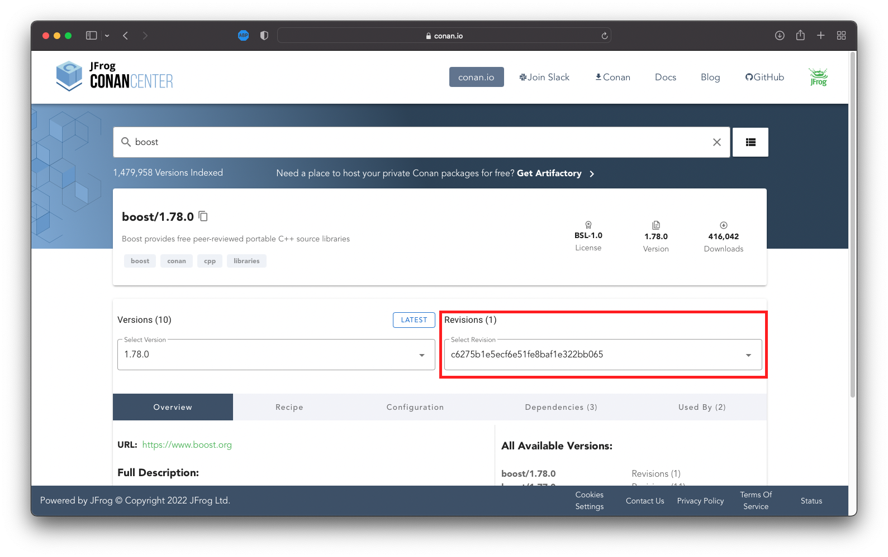

# Conan locks

This document gives you and understanding how conan locks work and how to use
them.

## Intro

The Conan package manager uses the version of the packed software for package
version (eg.: boost/1.72.0). Since the Conan itself is under development, it is
useful to use the new Conan features in the recipes, hence some packages get
recompiled time to time. When this happens, the version of the package itself
does not changes, since the packed software version remains the same and only
the recipe changes. However it may occure some changes in the recipe, that are
incompatible with older versions of Conan.

## Problem with unlocked dependencies

The problem with the unlocked software versions are obvious: if you always
download the master branch of a given library, you can easily find yourself in
a situation where you experience a new bug without touching the codebase, or
your codebase couldn't even build (if major change happens in the library and
the interface broke). This is handled by the package version itself
(boost/1.72.0), so it's a safe place.

But with the continuous development of Conan itself you can experience the
issue, where you didn't touch anything and the dependencies couldn't get
installed.

I've talked about the recompilation of conan packages in the intro, and you have
to note the fact: if no other version of the package set but the library
version, conan will install the given version with the latest recipe. This may
not be compatible with your conan version, and the dependency installation
fails.

Imagine the following situation: You have a build pipeline that uses a docker
image, that has 1.32.1 conan version in it. Everything works fine, but one day
a PR build fails with the error of conan unable to install boost/1.72.0. You
didn't change anything in the dependencies, but it's not working anymore. And
the cherry on top: it works on your local machine!

That's because you have a boost installed on your local machine so it doesn't
have to be reinstalled with every build. But the build pipeline reinstalls the
packeges for every build, and if a new recipe version come that starts with the
following line
```
required_conan_version = ">=1.33.0"
```
it can not be installed with the 1.32.1 Conan.

Since no other versions set in our conan system but the boost version itself,
Conan will install the latest recipe version every time it has to be installed,
and in this situation it causes failure.

This issue can be fixed with locking the recipe version as well.

> This case-study is so accurate, I faced this problem at a company I worked
    for :)

## Revision locking

The Conan recipes has a unique hash, that is unique for the given state of the
recipe (technically it's the hash of the recipe text). When the given package
gets repacked, the recipe itself changes, hence the recipe hash changes too.
This recipe hash called **recipe revision**\
\
Revision locking can be set with the #RREV tag after the package name. So to be
able to install a given package version and recipe version of boost we have to
do: 

```bash
conan install boost/1.72.0@#​1736e0bf8ab45c382c11f8f7a6a7727f
```

> The @ was used to note the user/channel, since the package version itself
    could contain # symbol. Since the conan.io packages has no user/channel, we
    usually omit the @, but in this situation it is mandatory as a separator.

If no recipe version set, the install always performed with the latest version
of the recipe!

## Binary package locking

Binary package is the binary artifact of a given package with given version with
given recipe revision and given settings (build type, compiler, platform, etc).
The hash of that particular artifact is the revision of the binary package.

So the binary revision (package revision) of boost/1.72.0 with the recipe
revision of ​1736e0bf8ab45c382c11f8f7a6a7727f built for x86_64 Linux with GCC in
**debug** mode will be an XXX hash, but the hash for the same package built in
**release** mode will be an YYY hash.

With the binary package locking we can set a lock for a given build. If you
use multi config environment (eg.: the developers switch between debug and
release mode), I suggest you to generate this config on the fly.

## How it works

### Generating Revision lock

Let's say, you have all the necessary packages installed, and you want all other
developers / build system to use this very version of the packages.

You can generate a revision lockfile with the following:

```bash
conan config set general.revisions_enabled=1\
conan lock create conanfile.py --base --lockfile-out=locks/deps.lock
```

The --base means it's a base lock file, it only contains recipe revisions, does
not say anything about binary artifacts. You can commit it to your codebase and
now on everybody that uses this base lockfile will have the very same recipe
revision configuration as you have.

### Using the Revision lock file

Before build we want to use this information to generate a build specific
locking. To do this we need:

```bash
conan config set general.revisions_enabled=1\
conan lock create conanfile.py --lockfile=locks/deps.lock --lockfile-out=locks/generated.lock
```

If we do so, the default conan profile will be used to identify all the build
settings. If this is not sufficent, we can set other parameters via the -s
option:

```bash
conan config set general.revisions_enabled=1\
conan lock create conanfile.py --lockfile=locks/deps.lock --lockfile-out=locks/generated.lock -s build_type=Release
```

### Installing conan packages with lockfiles

When we generate the (binary) package lockfile, all the required packages get
installed, so we have nothing to do with it any further (that's why it's
usually sufficent to provide only the base lock). If you want to omit the
package lockfile generation on the fly, you can generate the corresponding
package lockfile once, and use it in conan install.

Generating once:
```bash
conan config set general.revisions_enabled=1\
conan lock create conanfile.py --lockfile=locks/deps.lock --lockfile-out=locks/Release.package.lock -s build_type=Release
```

Using:
```bash
conan install --lockfile=locks/Release.package.lock
```

This second install needs nothing else, since all the required information are
in the lockfile itself.
